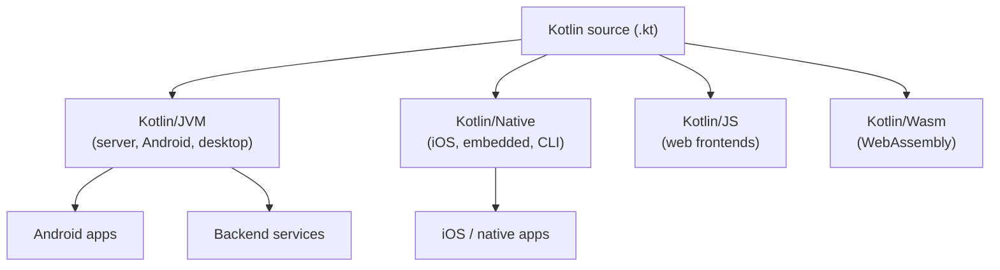

# Introduction to Kotlin

## What is Kotlin?

Kotlin is a modern, statically-typed programming language created by JetBrains.
It first appeared in 2011, reached 1.0 in 2016, and in 2017 Google announced
first-class support for Kotlin on Android — making it the preferred language for
Android development in 2019.

Kotlin is **concise**, **null-safe**, and **fully interoperable with Java**. It
runs on the Java Virtual Machine (JVM) but also compiles to native binaries,
JavaScript, and WebAssembly, which makes it a true multiplatform language.



## Why Kotlin?

| Feature | What it means for you |
|---------|-----------------------|
| **Concise** | Less boilerplate than Java — data classes, type inference, no semicolons |
| **Null safety** | The type system separates nullable (`String?`) from non-null (`String`), eliminating most `NullPointerException`s at compile time |
| **Java interop** | Call Java from Kotlin and Kotlin from Java seamlessly; adopt it gradually in existing projects |
| **Coroutines** | First-class, structured concurrency for asynchronous code without callback hell |
| **Multiplatform** | Share business logic across Android, iOS, web, and backend |
| **Tooling** | Built by the makers of IntelliJ IDEA, so IDE support is excellent |

## A first taste

Here is the same idea in Java and Kotlin so you can see the difference in style:

```java
// Java
public class Greeter {
    public String greeting(String name) {
        return "Hello, " + name + "!";
    }
}
```

```kotlin
// Kotlin
fun greeting(name: String): String = "Hello, $name!"
```

Kotlin infers types where it can, supports top-level functions (no class
required), and uses **string templates** (`$name`) for interpolation.

{: .note }
You do not need to know Java to learn Kotlin. This guide assumes only basic
programming familiarity. Where Kotlin improves on Java, we will point it out.

## Where this guide goes

- **Parts 1–2** get you set up and teach the core syntax.
- **Parts 3–5** cover object-oriented and functional programming.
- **Part 6** introduces coroutines for concurrency.
- **Parts 7–8** build real Android apps, from foundations to advanced architecture.
- **Part 9** ties everything together with capstone projects.

---

Next: [Setting Up Your Environment]()
