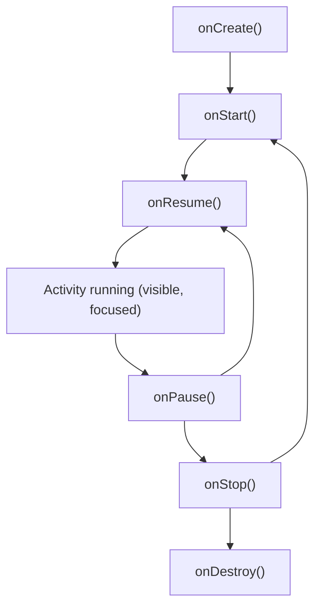

# Activity Lifecycle

An `Activity` moves through a well-defined set of states as the user navigates,
rotates the device, or switches apps. Understanding these callbacks is key to
saving state and releasing resources correctly.

## The lifecycle



| Callback | Called when | Typical use |
|----------|-------------|-------------|
| `onCreate` | Activity is created | Set content, initialize |
| `onStart` | Becoming visible | Start UI updates |
| `onResume` | Gains focus | Begin animations, acquire camera |
| `onPause` | Losing focus | Pause, save light state |
| `onStop` | No longer visible | Release resources |
| `onDestroy` | Being destroyed | Final cleanup |

## Configuration changes

By default, a configuration change (like rotation) **destroys and recreates** the
Activity. Anything held only in the Activity is lost. There are two robust ways
to survive this:

1. **Save UI state** with `rememberSaveable` in Compose (next chapters).
2. **Hold state in a `ViewModel`**, which survives configuration changes (see
   [Coroutines on Android]()).

```kotlin
@Composable
fun NameField() {
    // survives rotation
    var text by rememberSaveable { mutableStateOf("") }
    TextField(value = text, onValueChange = { text = it })
}
```

## Saving instance state (classic)

In the View system you override `onSaveInstanceState`:

```kotlin
override fun onSaveInstanceState(outState: Bundle) {
    super.onSaveInstanceState(outState)
    outState.putString("draft", currentDraft)
}
```

In Compose, prefer `rememberSaveable` and `ViewModel` instead.

{: .tip }
Rule of thumb: transient UI state → `rememberSaveable`; screen/business state that
should survive rotation → `ViewModel`.

## Exercises

1. Add `Log` statements to each lifecycle callback and observe the order when you
   rotate the device.

2. Use `rememberSaveable` for a text field and confirm its value survives a
   rotation.

---

Previous: [Android Setup & App Anatomy]() ·
Next: [UI & Jetpack Compose]()
