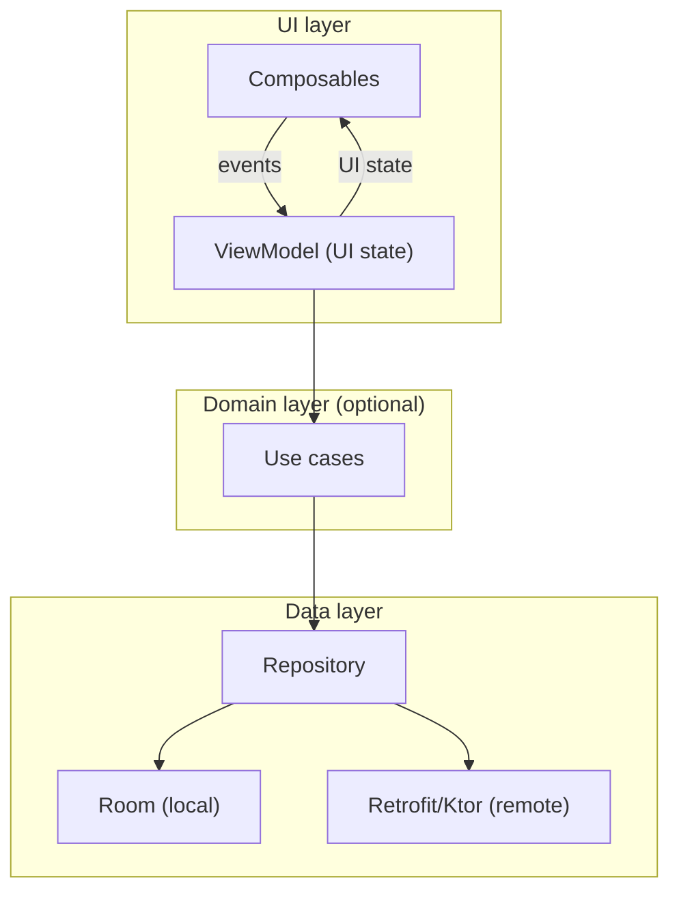

# App Architecture

A maintainable Android app separates concerns into layers and keeps data flowing
in one direction.

## The recommended layers



- **UI layer** — Composables render state and send events to a `ViewModel`.
- **Domain layer** (optional) — use cases hold business rules, keeping ViewModels
  thin.
- **Data layer** — repositories expose data, hiding whether it comes from the
  network or a local database.

## Unidirectional data flow (UDF)

State flows **down** (ViewModel → UI) and events flow **up** (UI → ViewModel).
The UI never mutates state directly; it asks the ViewModel to.

```kotlin
// State down, events up
@Composable
fun Screen(state: UiState, onRefresh: () -> Unit) { /* render + call onRefresh */ }
```

This makes state predictable: there is exactly one source of truth (the
ViewModel's `StateFlow`), and the UI is a pure function of it.

## MVVM and Clean Architecture

- **MVVM** maps directly onto the UI layer: Model (data) → ViewModel (state) →
  View (Composables).
- **Clean Architecture** generalizes this: dependencies point **inward** (UI →
  domain → data interfaces), so the core logic does not depend on Android or
  specific libraries.

## The repository pattern

A repository is the single entry point for a type of data. The ViewModel depends
on an **interface**, so it does not care about Room or Retrofit:

```kotlin
interface ArticleRepository {
    suspend fun articles(): List<Article>
}
```

The example app in `examples/android/` implements this with an in-memory source
to keep it buildable in CI; swapping in a Room- or network-backed implementation
changes nothing in the ViewModel.

{: .note }
This chapter sets the structure for the rest of Part 8. Each following chapter
adds one capability (Compose, navigation, state, persistence, networking, DI,
background work) into these layers.

---

Next: [Advanced Compose]()
