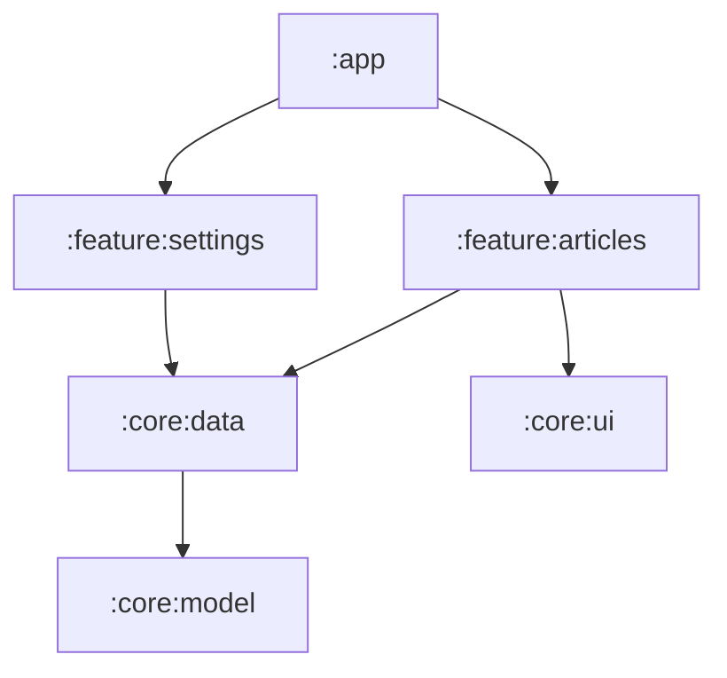

# Modularization & Build Variants

As an app grows, splitting it into Gradle **modules** improves build times
(parallel + incremental), enforces boundaries, and enables reuse.

## A typical module graph



- `:app` — wires everything together (DI, navigation host).
- `:feature:*` — one feature each (screens + ViewModels).
- `:core:*` — shared building blocks (`model`, `data`, `ui`, `network`).

Dependencies point **inward**: features depend on core, never the reverse, and
features do not depend on each other.

## Declaring modules

```kotlin
// settings.gradle.kts
include(":app", ":core:model", ":core:data", ":feature:articles")
```

A feature module's `build.gradle.kts` depends on the core modules it needs:

```kotlin
dependencies {
    implementation(project(":core:data"))
    implementation(project(":core:ui"))
}
```

## Version catalogs across modules

A single `gradle/libs.versions.toml` keeps every module on the same dependency
versions — exactly the pattern the guide's `examples/` use:

```kotlin
dependencies {
    implementation(libs.androidx.activity.compose)
    implementation(platform(libs.compose.bom))
}
```

## Build types and flavors

**Build types** (`debug`, `release`) differ in signing, shrinking, and
logging. **Product flavors** create variants like `free`/`paid` or
`dev`/`prod`:

```kotlin
android {
    buildTypes {
        release {
            isMinifyEnabled = true
            proguardFiles(getDefaultProguardFile("proguard-android-optimize.txt"))
        }
    }
    flavorDimensions += "tier"
    productFlavors {
        create("free") { dimension = "tier" }
        create("paid") { dimension = "tier" }
    }
}
```

This yields variants like `freeDebug`, `paidRelease`.

## Exercises

1. Sketch the module graph for an app with two features that share a data layer.

2. Add a `release` build type that enables minification.

---

Previous: [Background Work with WorkManager]() ·
Next: [Testing]()
