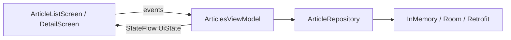

# Android Capstone: Articles App

Assemble a complete Android app on the [Part 8]()
architecture: a list/detail experience backed by a `ViewModel`, an immutable
`StateFlow` UI state, a repository behind an interface, navigation, and JSON
serialization.

The running architecture core is in `examples/android/` (package
`com.example.kotlinguide.articles`) and builds + unit-tests in CI.

## The pieces, end to end



### 1. Model + serialization

```kotlin
data class Article(val id: Int, val title: String, val body: String)

@Serializable
data class ArticleDto(val id: Int, val title: String, val body: String)
```

### 2. Repository (interface + implementation)

```kotlin
interface ArticleRepository { suspend fun articles(): List<Article> }

class InMemoryArticleRepository(private val data: List<Article> = sampleArticles) :
    ArticleRepository {
    override suspend fun articles(): List<Article> = data
}
```

### 3. ViewModel + UI state

```kotlin
sealed interface ArticlesUiState {
    data object Loading : ArticlesUiState
    data class Success(val articles: List<Article>) : ArticlesUiState
    data class Error(val message: String) : ArticlesUiState
}

class ArticlesViewModel(private val repository: ArticleRepository) : ViewModel() {
    private val _uiState = MutableStateFlow<ArticlesUiState>(ArticlesUiState.Loading)
    val uiState: StateFlow<ArticlesUiState> = _uiState.asStateFlow()
    fun load() = viewModelScope.launch { /* repository.articles() -> Success/Error */ }
}
```

### 4. Navigation + screens

A `NavHost` wires a list screen (which collects `uiState`) to a detail screen,
passing the article id as a route argument.

## Taking it to production

Swap the in-memory repository for real data sources using the drop-in code from
Part 8 — nothing in the ViewModel or UI changes:

1. **Persistence** — add a Room `ArticleDao` and a `LocalArticleRepository`
   (see [Room]()).
2. **Networking** — add a Retrofit `ArticleApi` + `RemoteArticleRepository`
   (see [Networking]()).
3. **DI** — bind the repository with Hilt and inject the ViewModel
   (see [Hilt]()).
4. **Background sync** — add a `CoroutineWorker`
   (see [WorkManager]()).

{: .note }
The architecture core (UI, ViewModel, repository interface, serialization,
navigation) builds and is unit-tested in CI. Room/Retrofit/Hilt/WorkManager are
provided as drop-in code because they need annotation processing and/or the
Android runtime — wire them in Android Studio to complete the production app.

## Extension challenges

1. Make the detail screen show the full article by looking it up in the
   repository (add `suspend fun article(id: Int): Article?`).

2. Add a pull-to-refresh that re-invokes `load()`.

3. Add a Room-backed cache so the list survives app restarts.

---

Previous: [CLI Capstone]() ·
Next: [Appendices]()
